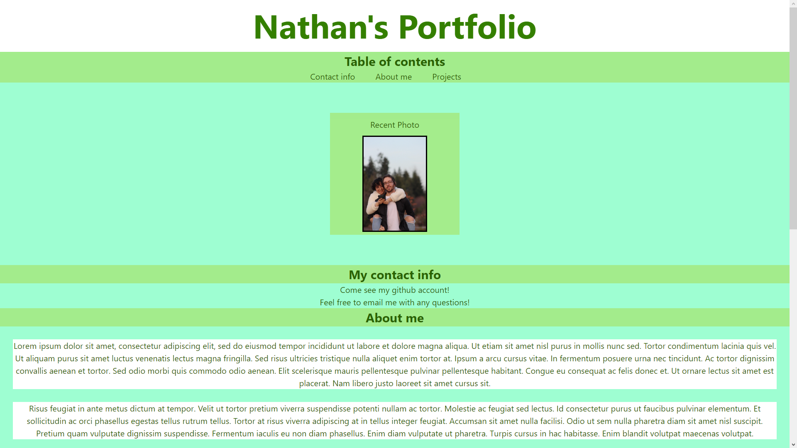

# <Your-Project-Title>

## Description

Provide a short description explaining the what, why, and how of your project. Use the following questions as a guide:

- What was your motivation?
Learning how to employ more profession elements of CSS.
- Why did you build this project? (Note: the answer is not "Because it was a homework assignment.")
To be able to build a simple portfolio, and be able to receive criticism.
- What problem does it solve?
Creating a way to show to employer what the user is capable of.
- What did you learn?
I got far better at understanding of how to adjust flexboxes, to link parts of the same webpage, and adjust the screen when the size is changed.

## Usage

Go to this link to see the website
https://nathansabin.github.io/porfolio-homework-2/ 

## Features

I have included a link to three websites included as pictures. I have a sentance that links to my github account, and one to send me an email, we have a large text box in the center of the page with a diffrent background. The content is adjusted while the screen size is moved.

## Tests

All links work, and the table of contents. You can click on any of the links any picture or link on the table of contents, you can also even email through this.
You can adjust the width and height nothing will overlap.